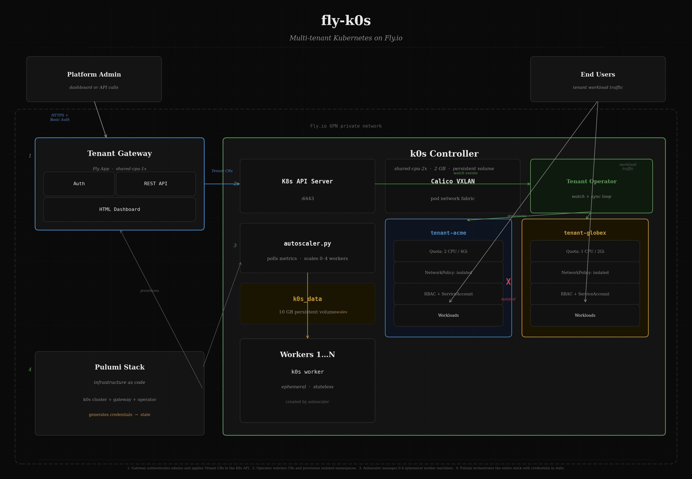
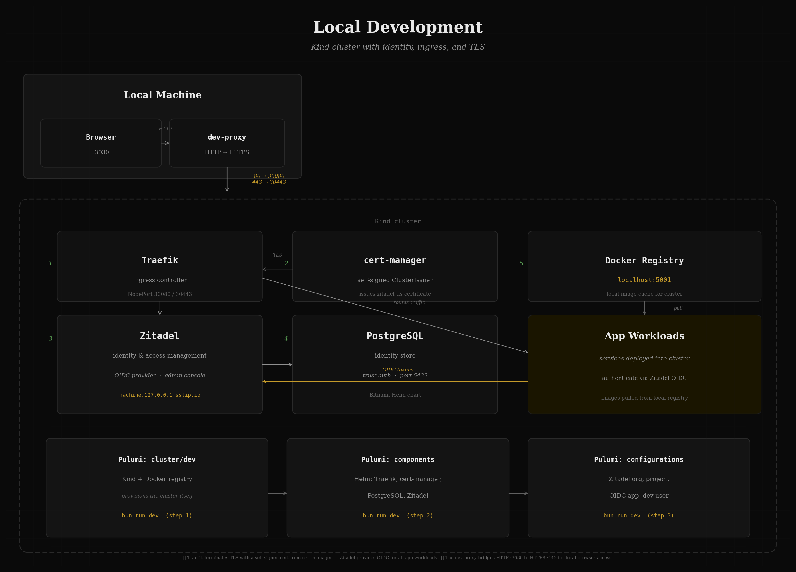

# fly-kube

Autoscaling k0s cluster on Fly.io with namespace-per-tenant isolation, a Rust tenant operator, and a gateway API for provisioning.

## Architecture



## Project Structure

```
├── infrastructure/             # Pulumi IaC
│   ├── pulumi/
│   │   ├── platform/
│   │   │   ├── fly/            # Fly.io k0s cluster + gateway + operator deploy
│   │   │   ├── staging/        # GCP CoreOS VM + GPU
│   │   │   ├── components/     # Helm: cert-manager, Traefik, PostgreSQL, Zitadel
│   │   │   └── configurations/ # Zitadel orgs, projects, OIDC apps, users
│   │   ├── cluster/
│   │   │   └── dev/            # Local k0s-in-Docker cluster + registry
│   │   └── modules/            # Reusable Pulumi components
│   └── scripts/                # Deploy, destroy, setup scripts
├── bootstrap/                  # Machine/bootstrap artifacts
│   ├── k0s/                    # Dockerfile, fly.toml, entrypoints, autoscaler
│   └── coreos/staging/         # Ignition config, SSH key generation
├── platform/                   # Shared cluster services (GitOps manifests)
│   ├── metrics-server/
│   ├── cert-manager/
│   ├── ingress/
│   └── zitadel/
├── clusters/                   # Per-environment GitOps entrypoints
│   ├── staging/
│   └── production/
├── apps/                       # Application workloads
│   └── example-service/
├── packages/                   # Buildable software
│   ├── tenant-crd/             # Shared Tenant CRD types (Rust lib)
│   ├── tenant-operator/        # K8s operator — watches Tenant CRs, provisions namespaces
│   ├── tenant-gateway/         # Fly app — REST API + HTML UI for tenant management
│   └── dev-proxy/              # Rust HTTP-to-HTTPS proxy
└── docs/                       # Architecture diagrams
```

## Quick Start

### Prerequisites

- [Pulumi CLI](https://www.pulumi.com/docs/install/)
- [flyctl](https://fly.io/docs/flyctl/install/)
- [bun](https://bun.sh)
- Docker
- Rust toolchain

### Deploy to Fly.io

```bash
fly auth login
pulumi login

cd infrastructure/pulumi/platform/fly
bun install
pulumi stack init prod
pulumi config set appName k0s-cluster
pulumi config set region ord
pulumi up --yes
```

This provisions:
- k0s cluster (controller + autoscaling workers)
- Tenant operator (built, imported into cluster, deployed)
- Tenant gateway (Fly app with auto-generated basic auth credentials)

Get your kubeconfig:

```bash
fly ssh console -a k0s-cluster -C 'cat /var/lib/k0s/pki/admin.conf' > kubeconfig.yaml
fly proxy 6443:6443 -a k0s-cluster &

# Edit kubeconfig.yaml: change server to https://127.0.0.1:6443
export KUBECONFIG=./kubeconfig.yaml
kubectl get nodes
```

### Tenant Management

Access the gateway dashboard at the URL from Pulumi outputs:

```bash
pulumi stack output outputGatewayUrl       # https://tenant-gateway.fly.dev
pulumi stack output outputGatewayAdminUser  # admin
pulumi stack output outputGatewayAdminPass  # auto-generated
```

Or use the API directly:

```bash
# Create a tenant
curl -u admin:$PASS -X POST https://tenant-gateway.fly.dev/tenants \
  -H 'Content-Type: application/json' \
  -d '{"name": "acme", "cpu": "2", "memory": "4Gi"}'

# List tenants
curl -u admin:$PASS https://tenant-gateway.fly.dev/tenants

# Delete a tenant
curl -u admin:$PASS -X DELETE https://tenant-gateway.fly.dev/tenants/acme
```

### Local Development (k0s-in-Docker)



```bash
bun run setup     # install all dependencies
bun run dev       # deploy k0s cluster + platform components + Zitadel config
bun run dev:destroy
```

### Staging (GCP)

```bash
# 1. Create bootstrap/coreos/staging/.env.staging from the .example
# 2. Generate ignition config
cd bootstrap/coreos/staging
./generate-ignition.sh

# 3. Deploy
bun run staging:deploy
bun run staging:status
```

## Testing

All Pulumi projects have unit tests using `bun:test` and `pulumi.runtime.setMocks()`. No cloud credentials needed.

```bash
bun run test    # all projects
cd infrastructure/pulumi/platform/fly && bun test   # single project
```

## Autoscaler Configuration

Set in `bootstrap/k0s/fly.toml`:

| Variable | Default | Description |
|---|---|---|
| `AUTOSCALER_HIGH_WATERMARK` | `80` | Scale up when allocation > this % |
| `AUTOSCALER_LOW_WATERMARK` | `30` | Scale down when allocation < this % |
| `AUTOSCALER_MAX_AGENTS` | `4` | Maximum worker machines |
| `AUTOSCALER_COOLDOWN_SECONDS` | `120` | Seconds between scaling events |
| `AUTOSCALER_CHECK_INTERVAL` | `30` | Seconds between metric checks |
| `AUTOSCALER_AGENT_VM_SIZE` | `shared-cpu-2x` | VM size for workers |
| `AUTOSCALER_AGENT_MEMORY_MB` | `2048` | Memory (MB) for workers |

## Monitoring

```bash
fly logs -a k0s-cluster | grep autoscaler
kubectl get nodes
kubectl top nodes
```
