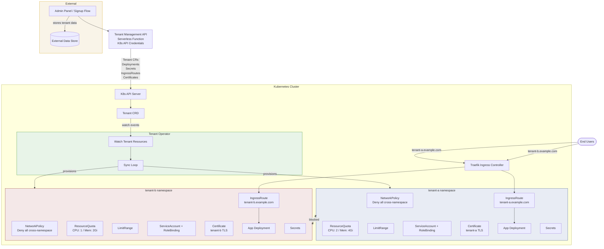

```mermaid
flowchart TB
    subgraph External
        DB[(External Data Store)]
        Admin[Admin Panel / Signup Flow]
    end

    subgraph Cluster[Kubernetes Cluster]
        API[K8s API Server]
        CRD[Tenant CRD]
        Traefik[Traefik Ingress Controller]

        subgraph Operator[Tenant Operator]
            Watch[Watch Tenant Resources]
            Sync[Sync Loop]
        end

        subgraph TenantA[tenant-a namespace]
            NP-A[NetworkPolicy\nDeny all cross-namespace]
            RQ-A[ResourceQuota\nCPU: 2 / Mem: 4Gi]
            LR-A[LimitRange]
            RBAC-A[ServiceAccount + RoleBinding]
            IR-A[IngressRoute\ntenant-a.example.com]
            TLS-A[Certificate\ntenant-a TLS]
            Deploy-A[App Deployment]
            Sec-A[Secrets]
        end

        subgraph TenantB[tenant-b namespace]
            NP-B[NetworkPolicy\nDeny all cross-namespace]
            RQ-B[ResourceQuota\nCPU: 1 / Mem: 2Gi]
            LR-B[LimitRange]
            RBAC-B[ServiceAccount + RoleBinding]
            IR-B[IngressRoute\ntenant-b.example.com]
            TLS-B[Certificate\ntenant-b TLS]
            Deploy-B[App Deployment]
            Sec-B[Secrets]
        end
    end

    Users([End Users]) -->|tenant-a.example.com| Traefik
    Users -->|tenant-b.example.com| Traefik
    Traefik --> IR-A --> Deploy-A
    Traefik --> IR-B --> Deploy-B

    Admin -->|stores tenant data| DB
    Admin --> Fn[Tenant Management API\nServerless Function\nK8s API Credentials] -->|Tenant CRs\nDeployments\nSecrets\nIngressRoutes\nCertificates| API
    API --> CRD
    CRD -->|watch events| Watch
    Watch --> Sync
    Sync -->|provisions| TenantA
    Sync -->|provisions| TenantB

    TenantA x--x|blocked| TenantB

    style External fill:#f9f4e8,stroke:#d4a017
    style Operator fill:#e8f4e8,stroke:#2d8a2d
    style TenantA fill:#e8ecf4,stroke:#2d4a8a
    style TenantB fill:#f4e8e8,stroke:#8a2d2d
```