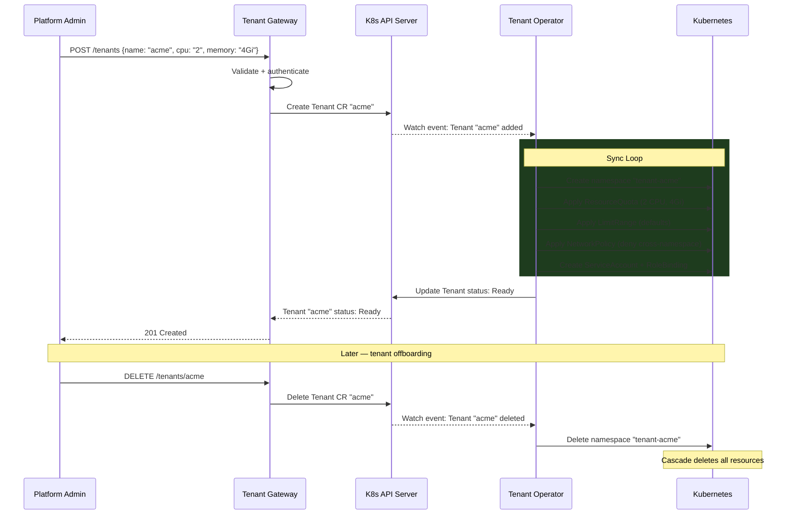

# Tenant Operator Architecture

## System Overview

```mermaid
flowchart TB
    subgraph Internet[" "]
        Users([End Users])
        AdminUser([Platform Admin])
    end

    subgraph Fly[Fly.io Platform]

        subgraph Gateway[Tenant Gateway — Fly App]
            Auth[Basic Auth Middleware]
            API-GW[REST API\nGET / POST / DELETE /tenants]
            UI[HTML Dashboard]
        end

        subgraph Cluster[k0s Kubernetes Cluster — Fly Machine]
            direction TB
            K8S[K8s API Server]

            subgraph ControlLoop[Tenant Operator Pod]
                Watch[Watch Tenant CRDs]
                Sync[Sync Loop]
            end

            subgraph CNI[Calico VXLAN]
                NetFabric[Pod Network Fabric]
            end

            subgraph TenantA[tenant-acme namespace]
                direction LR
                NS-A[Namespace]
                RQ-A[ResourceQuota\n2 CPU / 4Gi]
                NP-A[NetworkPolicy\nIsolated]
                RBAC-A[ServiceAccount\n+ RoleBinding]
                LR-A[LimitRange\n500m / 256Mi default]
                App-A[Workloads]
            end

            subgraph TenantB[tenant-globex namespace]
                direction LR
                NS-B[Namespace]
                RQ-B[ResourceQuota\n1 CPU / 2Gi]
                NP-B[NetworkPolicy\nIsolated]
                RBAC-B[ServiceAccount\n+ RoleBinding]
                LR-B[LimitRange\n500m / 256Mi default]
                App-B[Workloads]
            end
        end
    end

    subgraph Upstream[External Systems]
        DB[(Tenant Data Store)]
        Billing[Billing / Signup]
    end

    AdminUser -->|HTTPS + Basic Auth| Auth
    Auth --> UI
    Auth --> API-GW
    API-GW -->|create / update / delete\nTenant CRs| K8S
    Billing -->|webhook| API-GW
    API-GW -.->|stores tenant data| DB

    K8S -->|watch events| Watch
    Watch --> Sync
    Sync -->|provisions| TenantA
    Sync -->|provisions| TenantB

    TenantA x--x|network isolation| TenantB

    Users -->|tenant-acme.example.com| App-A
    Users -->|tenant-globex.example.com| App-B

    style Internet fill:none,stroke:none
    style Fly fill:#1a1a2e,stroke:#7c3aed,stroke-width:2px,color:#e2e8f0
    style Gateway fill:#1e3a5f,stroke:#3b82f6,stroke-width:2px
    style Cluster fill:#1a2e1a,stroke:#22c55e,stroke-width:2px
    style ControlLoop fill:#2d4a2d,stroke:#4ade80,stroke-width:1px
    style CNI fill:#2d3a2d,stroke:#4ade80,stroke-width:1px,stroke-dasharray: 5 5
    style TenantA fill:#1e293b,stroke:#3b82f6,stroke-width:2px
    style TenantB fill:#1e293b,stroke:#f59e0b,stroke-width:2px
    style Upstream fill:#2a1a1a,stroke:#ef4444,stroke-width:1px
```

## Tenant Lifecycle

```mermaid
sequenceDiagram
    participant Admin as Platform Admin
    participant GW as Tenant Gateway
    participant K8s as K8s API Server
    participant Op as Tenant Operator
    participant NS as Kubernetes

    Admin->>GW: POST /tenants {name: "acme", cpu: "2", memory: "4Gi"}
    GW->>GW: Validate + authenticate
    GW->>K8s: Create Tenant CR "acme"
    K8s-->>Op: Watch event: Tenant "acme" added

    rect rgb(30, 60, 30)
        Note over Op,NS: Sync Loop
        Op->>NS: Create namespace "tenant-acme"
        Op->>NS: Apply ResourceQuota (2 CPU, 4Gi)
        Op->>NS: Apply LimitRange (defaults)
        Op->>NS: Apply NetworkPolicy (deny cross-namespace)
        Op->>NS: Create ServiceAccount + RoleBinding
    end

    Op->>K8s: Update Tenant status: Ready
    K8s-->>GW: Tenant "acme" status: Ready
    GW-->>Admin: 201 Created

    Note over Admin,NS: Later — tenant offboarding

    Admin->>GW: DELETE /tenants/acme
    GW->>K8s: Delete Tenant CR "acme"
    K8s-->>Op: Watch event: Tenant "acme" deleted
    Op->>NS: Delete namespace "tenant-acme"
    Note over NS: Cascade deletes all resources
```

## Infrastructure Topology

```mermaid
flowchart LR
    subgraph Fly[Fly.io - ord region]
        direction TB

        subgraph Machines[Fly Machines]
            M1[k0s Controller\nshared-cpu-2x / 2GB\n+ persistent volume]
            M2[Tenant Gateway\nshared-cpu-1x / 256MB]
            M3[Worker 1\nautoscaled]
            M4[Worker N\nautoscaled]
        end

        PN[Fly Private Network\n6PN WireGuard Mesh]
    end

    subgraph Pulumi[Pulumi Stack]
        IaC[Infrastructure as Code]
    end

    IaC -->|provisions| M1
    IaC -->|provisions| M2
    IaC -->|generates creds\nstored in state| M2

    M1 <-->|K8s API\nover 6PN| M2
    M1 <-->|kubelet join| M3
    M1 <-->|kubelet join| M4
    M1 ---|autoscaler\n0-4 workers| M3

    style Fly fill:#1a1a2e,stroke:#7c3aed,stroke-width:2px,color:#e2e8f0
    style Machines fill:#1e293b,stroke:#3b82f6,stroke-width:1px
    style Pulumi fill:#2a1a1a,stroke:#ef4444,stroke-width:1px
```
